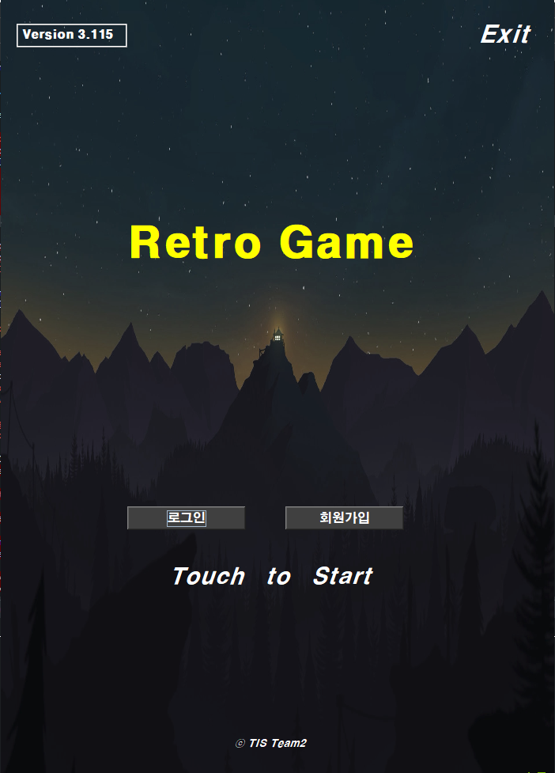
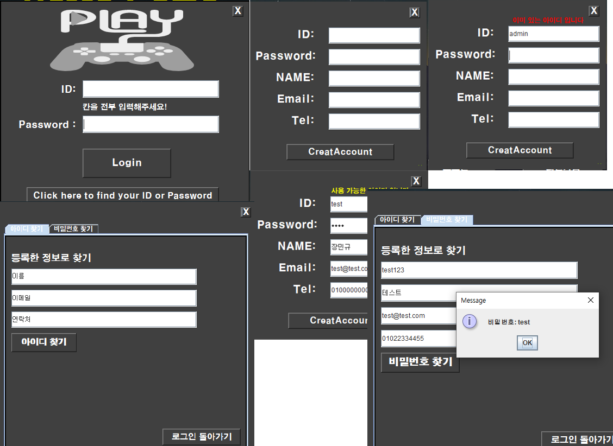
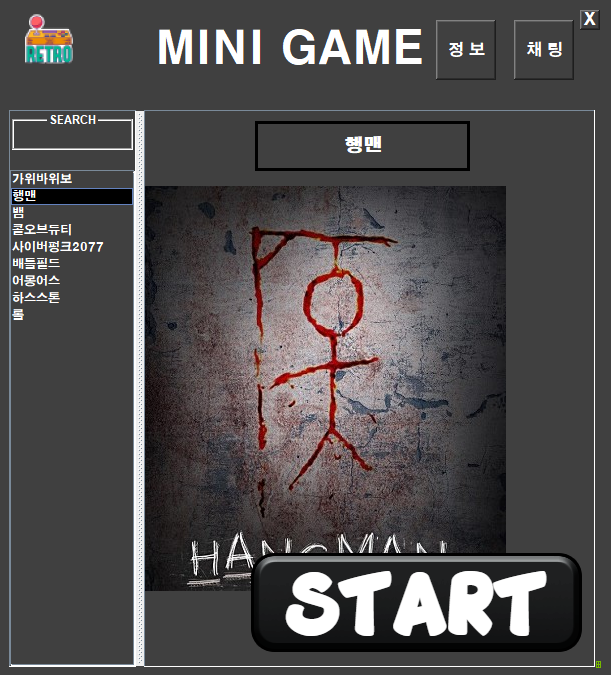
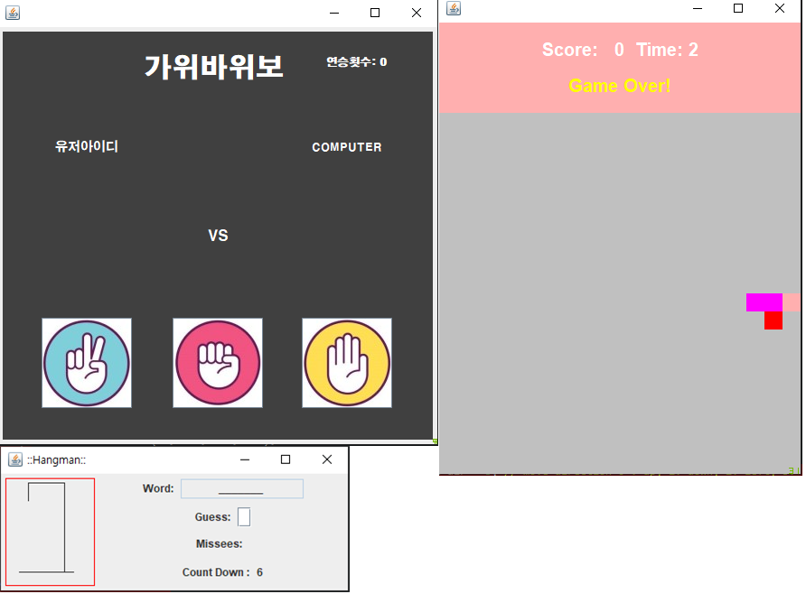
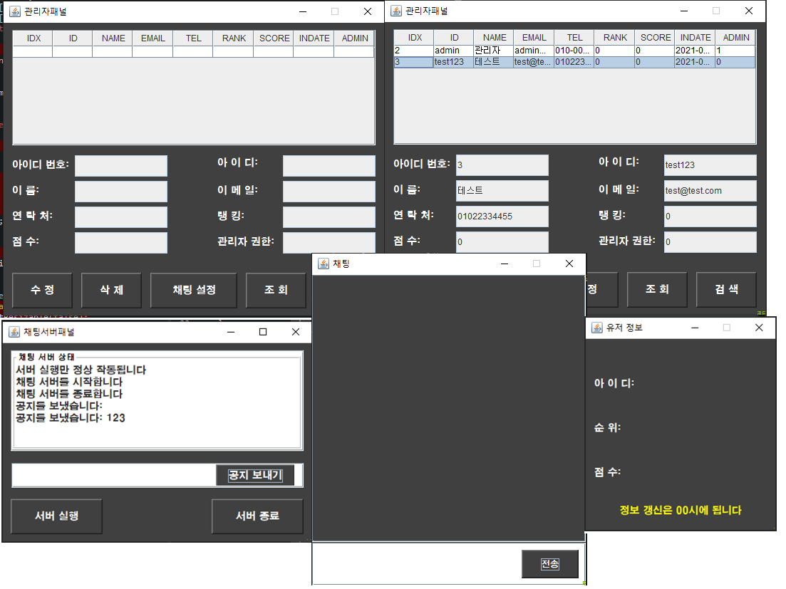

# RetroGame

## 프로젝트 기획의도

프로젝트 기획 당시 코로나 19 사태에도 게임 수요와 당시 레트로 감성이 인기가 있었던 것을 고려하고
어릴적 레트로 게임이라면 다양하게 있지만 게임을 하나만 하면 쉽게 흥미를 잃어 버린다는 점을 고려해 미니게임 시리즈 게임을 벤치마킹 했습니다

JDBC를 이용해 관리자는 유저정보를 쉽게 관리하기 만들었고
일부 게임은 스레드를 통해 동작하게 만들었습니다

## TIS 1차 GUI 프로젝트

제작:    
[팀장.장민규](https://github.com/Dokkabei97),   
손문창,   
박동규,   
장준환

***

## 프로젝트 사진으로 빠르게 훑어보기

</img>   
</img>   
</img>   
</img>   
</img>   
